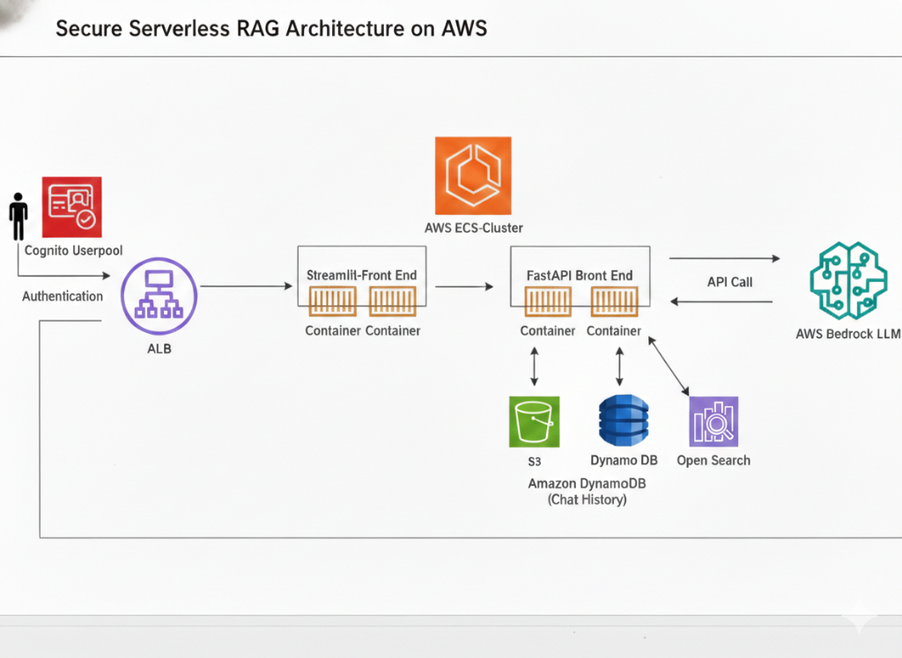

# AWS GenAI RAG Application

A serverless Retrieval-Augmented Generation (RAG) application built on AWS, designed to perform semantic search and Q&A over private documentation.

## 🚀 Features

- **Hybrid RAG**: Combines document context with general knowledge using AWS Bedrock (Titan models).
- **Serverless Architecture**:
    - **Frontend**: Streamlit running on ECS Fargate.
    - **Backend**: FastAPI running on ECS Fargate.
    - **Vector Store**: OpenSearch Serverless.
    - **Auth**: Amazon Cognito (JWT).
- **Infrastructure as Code**: 100% Terraform managed.
- **Secure**: OIDC authentication for CI/CD, private VPC subnets.

## 📚 Documentation

Detailed guides are available in the `docs/` directory:

- [**Design Document**](./docs/design-document.md): Architecture, data flow, and component details.
- [**Terraform Implementation Guide**](./docs/terraform-implementation-guide.md): **Start here to deploy resources.**
- [**GitHub CI/CD Setup**](./docs/github-cicd-setup.md): How to set up the automated deployment pipeline.
- [**AWS CLI Guide**](./docs/aws-cli-implementation-guide.md): Manual deployment via CLI.
- [**AWS Console Guide**](./docs/aws-console-implementation-guide.md): Manual deployment via AWS Console.

## 🚀 Deployment (GitHub Actions)

This project is configured with a fully automated CI/CD pipeline.

### 1. Automated Deployment
The **Deploy GenApp** workflow runs automatically whenever you push changes to the `main` branch.
- **Triggers**: Push to `main`.
- **Actions**:
  - Sets up OIDC authentication (No hardcoded keys).
  - Initializes Terraform.
  - Plans and Applies the infrastructure changes.
  - Builds and pushes Docker images to ECR.
  - Deploys new containers to ECS Fargate.

### 2. Manual Destruction
To save costs, you can destroy the entire infrastructure using the **Destroy GenApp** workflow. This workflow **must be triggered manually** to prevent accidents.
- **How to run**:
  1. Go to **Actions** tab in GitHub.
  2. Select **Destroy GenApp** from the left sidebar.
  3. Click **Run workflow**.
- **Actions**:
  - Runs `terraform destroy`.
  - Removes all resources (including S3 buckets and OpenSearch collections).

## 💻 Alternative: Local Deployment (Terraform)

If you prefer running locally:

For full instructions including variable configuration and post-deployment steps, see the [Terraform Implementation Guide](./docs/terraform-implementation-guide.md).

## 🏗️ Architecture

The solution uses:
- **AWS Bedrock**: Foundation Models (Titan Text, Titan Embeddings).
- **Amazon OpenSearch Serverless**: Vector database for embeddings.
- **Amazon ECS Fargate**: Container orchestration.
- **Amazon S3**: Document storage.
- **Amazon DynamoDB**: Chat history.
- **Amazon Cognito**: User authentication.

---
*Built by Sanoj Ma*
