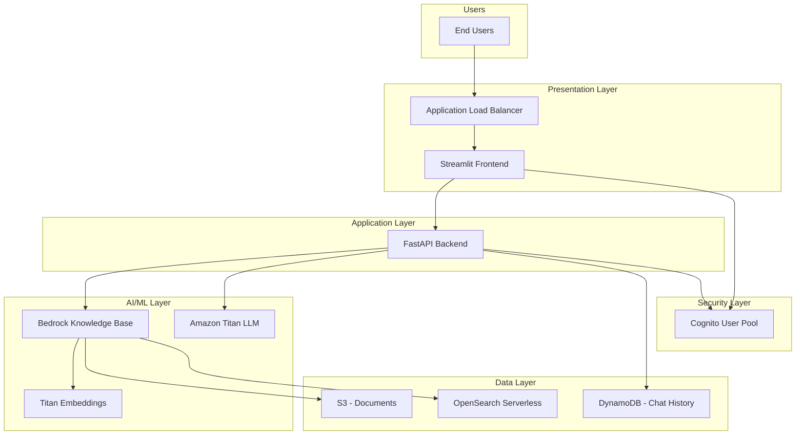
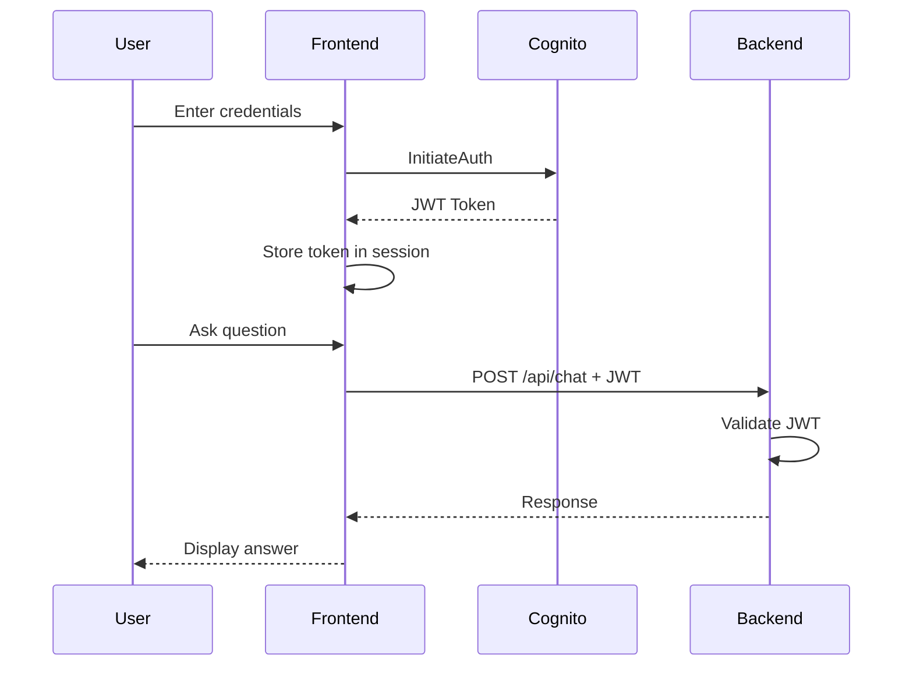
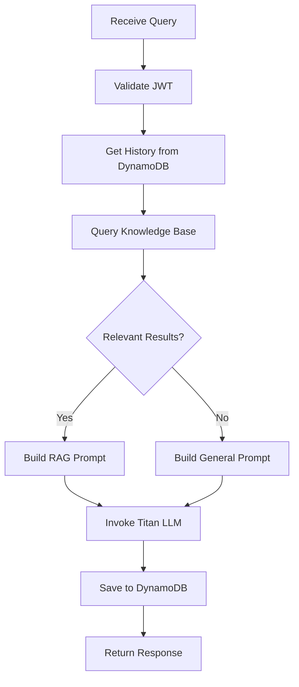
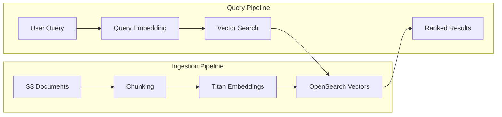
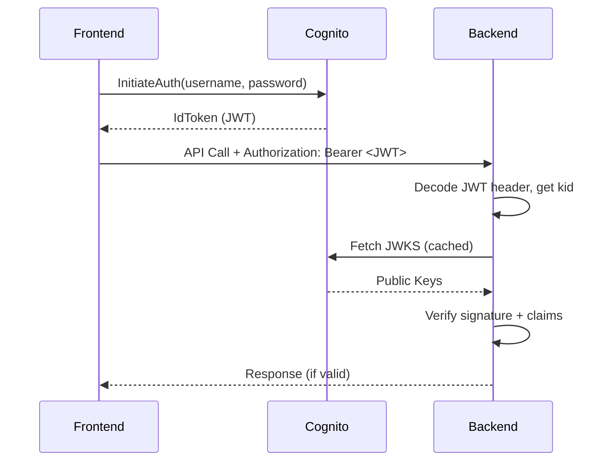
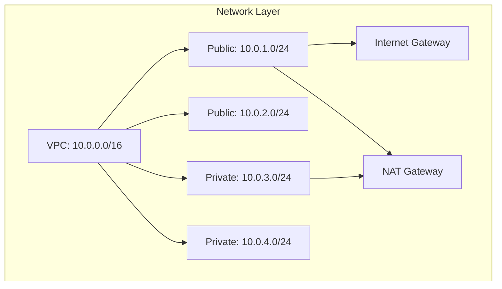
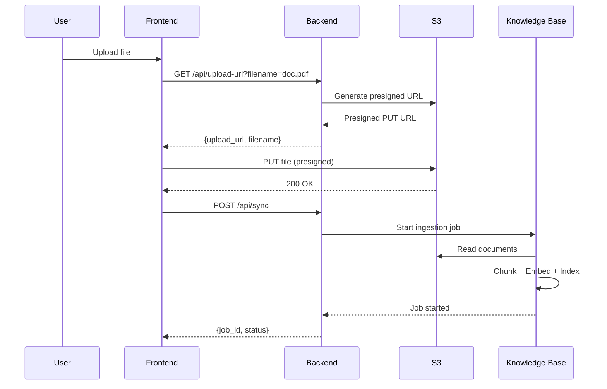
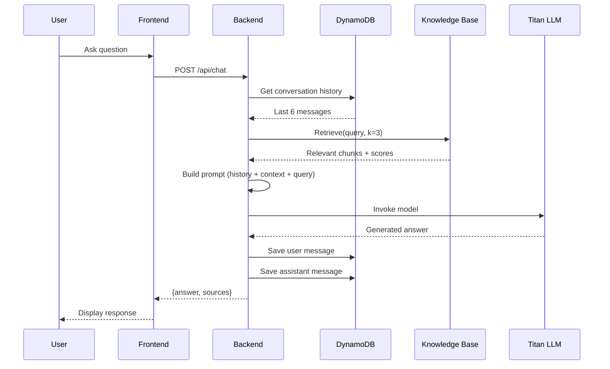
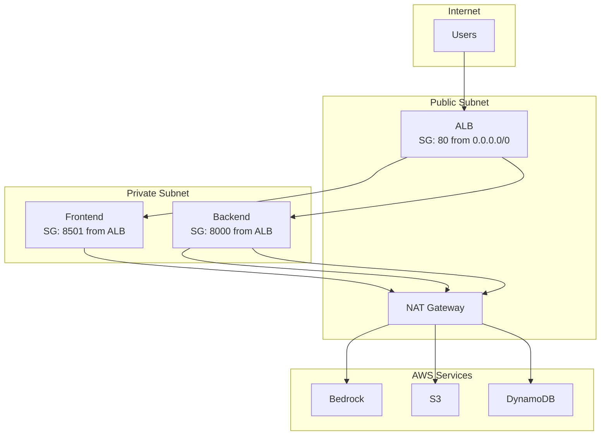

# GenApp RAG Application - Design Document

## Table of Contents
1. [Executive Summary](#executive-summary)
2. [High-Level Design (HLD)](#high-level-design-hld)
3. [Low-Level Design (LLD)](#low-level-design-lld)
4. [Solution Components](#solution-components)
5. [Architecture Decisions](#architecture-decisions)
6. [Data Flow](#data-flow)
7. [Security Architecture](#security-architecture)
8. [Implementation Guide](#implementation-guide)

---

## Executive Summary.

GenApp is a **Retrieval-Augmented Generation (RAG)** application that enables users to upload documents and ask questions about them using natural language. The system combines AWS Bedrock's Knowledge Base for semantic document retrieval with Amazon Titan for intelligent response generation.

### Key Capabilities

- 📄 Document upload and indexing
- 🔍 Semantic search across documents
- 💬 Conversational AI with memory
- 🔐 JWT-based authentication
- 📊 Hybrid RAG (documents + general knowledge)

---

## High Level Design (HLD)

### System Overview.



### Component Summary

| Layer | Component | Purpose |
|-------|-----------|---------|
| **Presentation** | Streamlit | User interface |
| **API** | FastAPI | REST API, business logic |
| **AI/ML** | Bedrock KB + Titan | RAG + LLM |
| **Storage** | S3, DynamoDB, OpenSearch | Documents, history, vectors |
| **Security** | Cognito | Authentication & JWT |
| **Infrastructure** | ECS Fargate | Serverless containers |

---

## Low-Level Design (LLD)

### 1. Frontend Component (Streamlit)

```
frontend/
├── app.py              # Main application
├── requirements.txt    # Dependencies
└── Dockerfile          # Container build
```

#### Key Functions

| Function | Purpose |
|----------|---------|
| `login()` | Authenticates with Cognito, stores JWT |
| `get_auth_headers()` | Returns Authorization header with JWT |
| `upload_file()` | Gets presigned URL, uploads to S3 |
| `send_message()` | Sends query to backend with JWT |

#### Flow Diagram



### 2. Backend Component (FastAPI)

```
backend/
├── main.py             # API endpoints
├── requirements.txt    # Dependencies
└── Dockerfile          # Container build
```

#### API Endpoints

| Endpoint | Method | Auth | Purpose |
|----------|--------|------|---------|
| `/` | GET | No | Health check |
| `/api/chat` | POST | JWT | Process query, return answer |
| `/api/history/{session_id}` | GET | JWT | Get chat history |
| `/api/upload-url` | GET | JWT | Get presigned S3 URL |
| `/api/sync` | POST | JWT | Trigger KB ingestion |

#### Chat Endpoint Flow



### 3. Knowledge Base Component



#### Configuration

| Parameter | Value | Purpose |
|-----------|-------|---------|
| Embedding Model | `amazon.titan-embed-text-v2:0` | Text to vectors |
| Vector Dimensions | 1024 | Embedding size |
| Chunk Size | 300 tokens | Document splitting |
| Chunk Overlap | 20% | Context continuity |
| Top-K Results | 3 | Retrieved contexts |

### 4. Authentication Component



---

## Solution Components

### AWS Services Used

| Service | Purpose | Configuration |
|---------|---------|---------------|
| **VPC** | Network isolation | 10.0.0.0/16, 2 AZs |
| **ECS Fargate** | Container orchestration | 256 CPU, 512 MB |
| **ALB** | Load balancing | Path-based routing |
| **ECR** | Container registry | 2 repos (FE/BE) |
| **S3** | Document storage | Private, versioned |
| **DynamoDB** | Chat history | On-demand, TTL enabled |
| **OpenSearch Serverless** | Vector store | Managed, auto-scaling |
| **Bedrock Knowledge Base** | RAG retrieval | S3 data source |
| **Bedrock Runtime** | LLM inference | Titan Text Express |
| **Cognito** | Authentication | User pool + app client |

### Resource Specifications



---

## Architecture Decisions

### ADR-001: ECS Fargate vs EC2

| Aspect | Decision | Rationale |
|--------|----------|-----------|
| **Choice** | ECS Fargate | Serverless, no EC2 management |
| **Trade-off** | Higher per-task cost | Lower operational overhead |
| **Alternative** | ECS on EC2 | Better for steady-state workloads |

### ADR-002: OpenSearch Serverless vs Provisioned

| Aspect | Decision | Rationale |
|--------|----------|-----------|
| **Choice** | Serverless | Auto-scaling, no capacity planning |
| **Trade-off** | Higher per-OCU cost | Zero management |
| **Alternative** | Provisioned | Better for predictable workloads |

### ADR-003: Amazon Titan vs Claude

| Aspect | Decision | Rationale |
|--------|----------|-----------|
| **Choice** | Amazon Titan | Included in Bedrock, no extra setup |
| **Trade-off** | Content filters (e.g., "voting") | Lower cost, simpler integration |
| **Alternative** | Claude 3.5 Sonnet | Better quality, requires payment |

### ADR-004: JWT Validation Location

| Aspect | Decision | Rationale |
|--------|----------|-----------|
| **Choice** | Backend (FastAPI) | Full control, no API Gateway needed |
| **Trade-off** | Custom code | Flexibility |
| **Alternative** | API Gateway + Authorizer | Managed, but adds latency |

### ADR-005: Conversation Memory

| Aspect | Decision | Rationale |
|--------|----------|-----------|
| **Choice** | DynamoDB with TTL | Serverless, auto-cleanup |
| **Trade-off** | No complex queries | Simple, scalable |
| **Alternative** | Redis | Faster, but needs management |

---

## Data Flow

### Document Upload Flow



### Query Processing Flow



---

## Security Architecture

### Network Security



### Authentication Flow

| Step | Component | Action |
|------|-----------|--------|
| 1 | Frontend | User enters credentials |
| 2 | Cognito | Validates password, returns JWT |
| 3 | Frontend | Stores JWT in session |
| 4 | Frontend | Sends JWT with every API call |
| 5 | Backend | Validates JWT signature with JWKS |
| 6 | Backend | Extracts user identity from claims |

### IAM Roles

| Role | Purpose | Key Permissions |
|------|---------|-----------------|
| `genapp-dev-execution-role` | ECS task execution | ECR pull, CloudWatch logs |
| `genapp-dev-task-role` | Application runtime | Bedrock, S3, DynamoDB, Cognito |
| `genapp-dev-kb-role` | Knowledge Base | S3 read, OpenSearch, Bedrock embeddings |

---

## Implementation Guide

### Option 1: Terraform (Recommended)

See [Terraform Implementation Guide](./terraform-implementation-guide.md)

```bash
# Quick start
cd terraform
terraform init
terraform plan
terraform apply -auto-approve
```

### Option 2: AWS CLI

See [AWS CLI Implementation Guide](./aws-cli-implementation-guide.md)

### Option 3: AWS Console (GUI)

See [AWS Console Implementation Guide](./aws-console-implementation-guide.md)

---

## Appendix

### Environment Variables

| Variable | Component | Purpose |
|----------|-----------|---------|
| `AWS_REGION` | Backend | AWS region |
| `KB_ID` | Backend | Knowledge Base ID |
| `KB_BUCKET_NAME` | Backend | S3 bucket for documents |
| `DYNAMODB_TABLE` | Backend | Chat history table |
| `COGNITO_USER_POOL_ID` | Backend | User Pool for JWT validation |
| `COGNITO_CLIENT_ID` | Backend | App Client for JWT validation |
| `COGNITO_USER_POOL_ID` | Frontend | User Pool for login |
| `COGNITO_CLIENT_ID` | Frontend | App Client for login |
| `BACKEND_URL` | Frontend | Backend API URL |

### Cost Estimation (Development)

| Service | Estimated Monthly Cost |
|---------|----------------------|
| ECS Fargate (2 tasks) | ~$30 |
| NAT Gateway | ~$35 |
| OpenSearch Serverless | ~$50 (min 2 OCUs) |
| ALB | ~$20 |
| S3 | ~$1 |
| DynamoDB | ~$1 |
| Bedrock | Pay per token |
| **Total** | **~$137/month** |

### References

- [AWS Bedrock Documentation](https://docs.aws.amazon.com/bedrock/)
- [AWS ECS Documentation](https://docs.aws.amazon.com/ecs/)
- [FastAPI Documentation](https://fastapi.tiangolo.com/)
- [Streamlit Documentation](https://docs.streamlit.io/)
